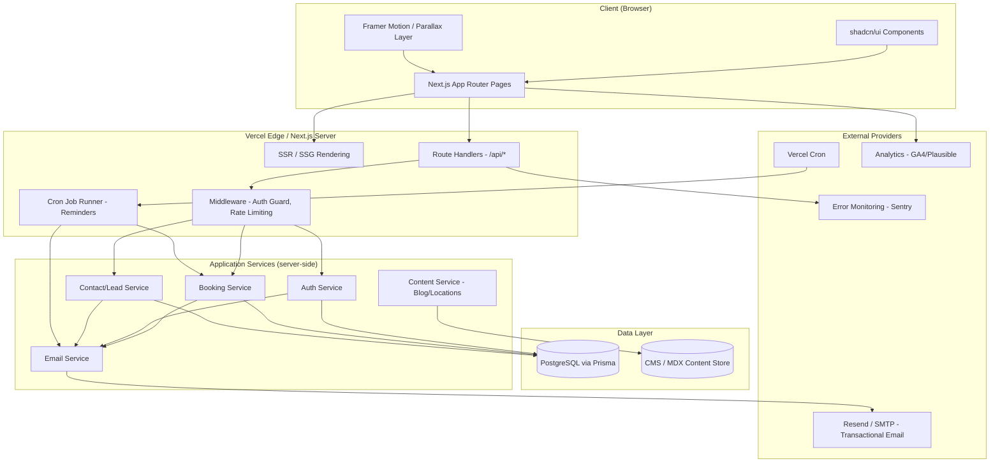
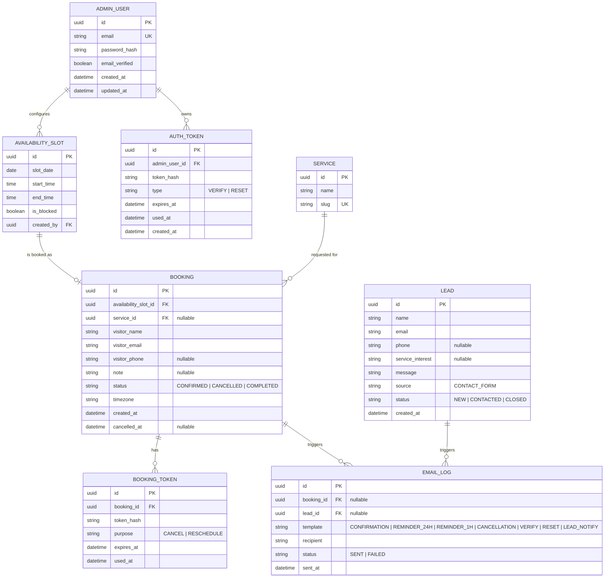
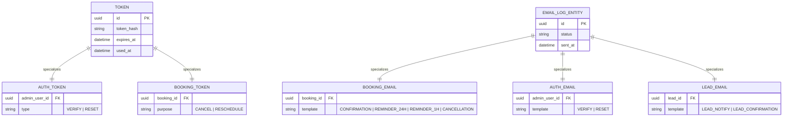
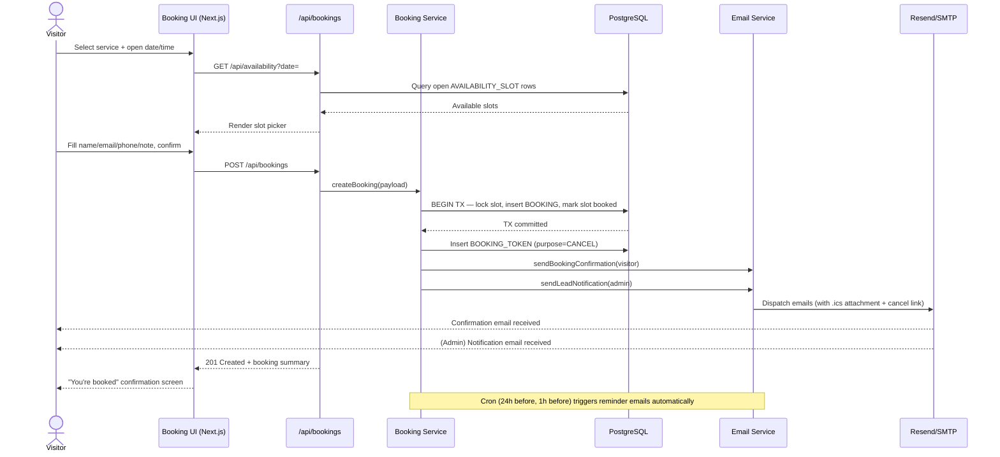
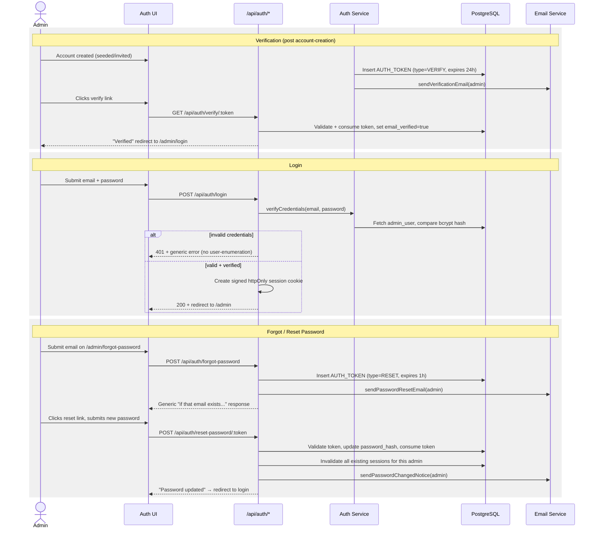
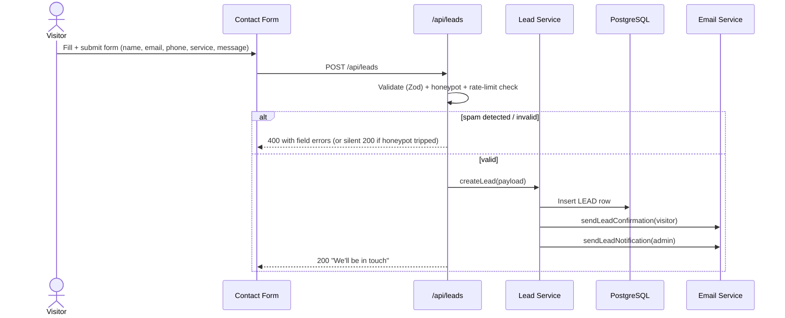
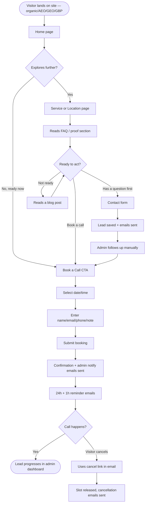
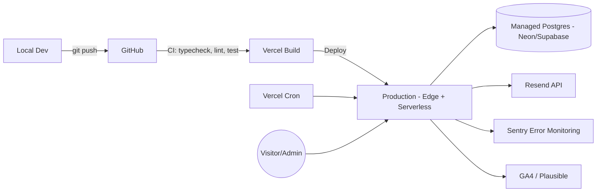

# H4Ai Website — Architecture Document

**Companion to:** `prd.md`, `design.md`, `seo_aeo_geo.md`, `phases.md`
**Diagram format:** Mermaid (renders natively on GitHub/GitLab and most Markdown viewers; paste into [mermaid.live](https://mermaid.live) if your viewer doesn't render it)

---

## 1. High-Level System Architecture



**Key decisions:**
- All mutating operations (booking, auth, contact) go through **Route Handlers** guarded by **Middleware** (session check for `/admin/*`, rate limiting for public POST endpoints).
- **Email Service** is a single internal abstraction over Resend (primary) with SMTP/Nodemailer as a fallback transport — every other service calls this one module rather than talking to the provider directly, so the provider can be swapped without touching booking/auth/contact logic.
- **Content Service** reads blog posts and location-page copy from MDX files or a headless CMS, decoupled from the transactional data in Postgres — content editors never touch the booking/lead tables.

---

## 2. Tech Stack Rationale

| Choice | Reason |
|---|---|
| Next.js App Router | Native SSR/SSG per route → required for `seo_aeo_geo.md` (meta tags, schema, Core Web Vitals); Route Handlers give us a first-party API without a separate backend service |
| TypeScript | Shared types between DB (Prisma-generated), API contracts, and forms (Zod) — one source of truth end to end |
| Prisma + PostgreSQL | Relational data (bookings, tokens, leads) with real foreign keys and constraints — critical for booking-slot integrity |
| Resend (+ SMTP fallback) | Modern deliverability, simple API, good Next.js support; SPF/DKIM/DMARC setup on `h4ai.in` domain required (see `seo_aeo_geo.md` technical checklist) |
| Framer Motion | Scroll-linked parallax + fade-up without hand-rolled Intersection Observer boilerplate |
| shadcn/ui | Accessible primitives (Dialog, Form, Calendar, Toast) we theme to the palette in `design.md` rather than fight a heavier component library |
| Vercel Cron | Reminder emails (24h / 1h) need a scheduled trigger outside the request/response cycle |

---

## 3. Data Model — Entity Relationship (ER) Diagram



**Notes:**
- `AVAILABILITY_SLOT` is generated by admin-configured working hours (recurring rule) materialized into concrete bookable slots — prevents double-booking via a unique constraint on `(slot_date, start_time)` combined with a one-to-one relationship to `BOOKING`.
- `AUTH_TOKEN` and `BOOKING_TOKEN` are deliberately separate tables (not one polymorphic "tokens" table) so admin-auth tokens and public booking-cancellation tokens never share a namespace or permission model — a leaked cancellation token can never be replayed against the auth system.
- Tokens store a **hash**, never the raw token — the raw value only ever exists in the emailed link and briefly in memory server-side.

---

## 4. Extended ER (EER) — Generalization/Specialization View

The EER view makes explicit the two places where the schema uses a supertype/subtype pattern (flattened into discriminator columns in the physical schema above, but conceptually generalized here):



**Why this matters for build order:** the `TOKEN` supertype (disjoint, total specialization — every token is exactly one of AUTH or BOOKING) and the `EMAIL_LOG` supertype (disjoint, total specialization across BOOKING/AUTH/LEAD) are exactly why the physical schema in §3 uses a single table per concept with a `type`/`template` discriminator rather than three separate token tables — it keeps expiry/cleanup logic (a scheduled job purging expired tokens) written once against one table instead of three.

---

## 5. Sequence Diagram — Booking Flow



## 6. Sequence Diagram — Cancellation Flow

```mermaid
sequenceDiagram
    actor V as Visitor
    participant Link as Emailed Cancel Link
    participant API as /api/bookings/cancel/[token]
    participant BS as Booking Service
    participant DB as PostgreSQL
    participant ES as Email Service

    V->>Link: Clicks cancel link
    Link->>API: GET /api/bookings/cancel/:token
    API->>DB: Look up BOOKING_TOKEN by hash(token)
    alt token invalid/expired/used
        API-->>V: "This link has expired" branded page
    else token valid
        API-->>V: Render confirm-cancellation page
        V->>API: POST confirm cancellation
        API->>BS: cancelBooking(bookingId)
        BS->>DB: Update BOOKING.status=CANCELLED, release AVAILABILITY_SLOT
        BS->>DB: Mark BOOKING_TOKEN.used_at
        BS->>ES: sendCancellationConfirmed(visitor + admin)
        API-->>V: "Booking cancelled" confirmation
    end
```

## 7. Sequence Diagram — Authentication (Signup Verify / Login / Reset)



## 8. Sequence Diagram — Contact Form Submission



## 9. User Flow — End-to-End Visitor Journey



## 10. User Flow — Admin

```mermaid
flowchart TD
    A([Admin visits /admin]) --> B{Has session?}
    B -->|No| C[/admin/login]
    B -->|Yes| Dash[Admin Dashboard]
    C --> D{Verified account?}
    D -->|No| E[Blocked — prompt to verify email]
    D -->|Yes, correct creds| Dash
    C --> F[Forgot password?] --> G[Reset flow] --> C
    Dash --> H[View Bookings]
    Dash --> I[View Leads]
    Dash --> J[Manage Availability]
    H --> K[Manually cancel a booking] --> L[Cancellation emails sent]
```

## 11. API Surface (Route Handlers)

| Method & Route | Auth | Purpose |
|---|---|---|
| `GET /api/availability` | Public | Returns bookable slots for a date range |
| `POST /api/bookings` | Public (rate-limited) | Creates a booking, sends confirmation + admin notify |
| `GET /api/bookings/cancel/:token` | Token-gated | Validates cancellation token, renders confirm screen |
| `POST /api/bookings/cancel/:token` | Token-gated | Executes cancellation |
| `POST /api/leads` | Public (rate-limited + honeypot) | Creates a contact-form lead |
| `POST /api/auth/login` | Public (rate-limited) | Authenticates admin, sets session cookie |
| `POST /api/auth/logout` | Session | Clears session |
| `GET /api/auth/verify/:token` | Token-gated | Verifies admin email |
| `POST /api/auth/forgot-password` | Public (rate-limited) | Issues reset token + email |
| `POST /api/auth/reset-password/:token` | Token-gated | Sets new password, invalidates sessions |
| `GET/POST /api/admin/bookings` | Session (admin) | List/manage bookings |
| `GET/POST /api/admin/leads` | Session (admin) | List/manage leads |
| `GET/POST /api/admin/availability` | Session (admin) | Configure working hours/blackout dates |
| `POST /api/cron/reminders` | Cron secret header | Triggered by Vercel Cron; sends due 24h/1h reminder emails |
| `POST /api/cron/token-cleanup` | Cron secret header | Purges expired AUTH_TOKEN/BOOKING_TOKEN rows |

## 12. Folder Structure (Next.js App Router)

```
h4ai-website/
├── app/
│   ├── (marketing)/
│   │   ├── page.tsx                     # Home
│   │   ├── services/
│   │   │   ├── page.tsx
│   │   │   ├── social-media-management/page.tsx
│   │   │   ├── website-development/page.tsx
│   │   │   ├── ai-integration-development/page.tsx
│   │   │   ├── ai-voice-agents/page.tsx
│   │   │   └── agentic-ai-systems/page.tsx
│   │   ├── locations/[city]/page.tsx
│   │   ├── about/page.tsx
│   │   ├── contact/page.tsx
│   │   ├── blog/page.tsx
│   │   └── blog/[slug]/page.tsx
│   ├── (booking)/
│   │   ├── book-a-call/page.tsx
│   │   └── cancel-booking/[token]/page.tsx
│   ├── (admin)/
│   │   ├── admin/login/page.tsx
│   │   ├── admin/verify/[token]/page.tsx
│   │   ├── admin/forgot-password/page.tsx
│   │   ├── admin/reset-password/[token]/page.tsx
│   │   └── admin/(protected)/
│   │       ├── layout.tsx               # session guard
│   │       ├── page.tsx                 # dashboard home
│   │       ├── bookings/page.tsx
│   │       ├── leads/page.tsx
│   │       └── availability/page.tsx
│   ├── api/
│   │   ├── availability/route.ts
│   │   ├── bookings/route.ts
│   │   ├── bookings/cancel/[token]/route.ts
│   │   ├── leads/route.ts
│   │   ├── auth/login/route.ts
│   │   ├── auth/logout/route.ts
│   │   ├── auth/verify/[token]/route.ts
│   │   ├── auth/forgot-password/route.ts
│   │   ├── auth/reset-password/[token]/route.ts
│   │   ├── admin/bookings/route.ts
│   │   ├── admin/leads/route.ts
│   │   ├── admin/availability/route.ts
│   │   └── cron/
│   │       ├── reminders/route.ts
│   │       └── token-cleanup/route.ts
│   ├── not-found.tsx                    # branded 404
│   ├── error.tsx                        # error boundary
│   └── layout.tsx                       # root layout, fonts, providers
├── components/
│   ├── ui/                              # shadcn/ui themed components
│   ├── marketing/                       # hero, section cards, proof stats
│   ├── booking/                         # slot picker, booking form
│   └── admin/                           # dashboard tables, forms
├── lib/
│   ├── prisma.ts
│   ├── auth/ (session, hashing, tokens)
│   ├── email/ (Resend client, templates, send wrapper)
│   ├── booking/ (slot generation, conflict checks)
│   └── validation/ (Zod schemas)
├── content/                             # MDX blog posts + location page content
├── prisma/
│   └── schema.prisma
├── public/
│   └── assets/ (logo, og-images)
└── middleware.ts                        # auth guard + rate limiting
```

## 13. Deployment Architecture



- **Environments:** `local` → `preview` (per-PR Vercel preview deploys) → `production`.
- **Secrets:** DB connection string, Resend API key, session secret, cron secret — stored in Vercel environment variables, never committed.
- **Migrations:** Prisma migrations run as part of the build/deploy pipeline against the target environment's database.
