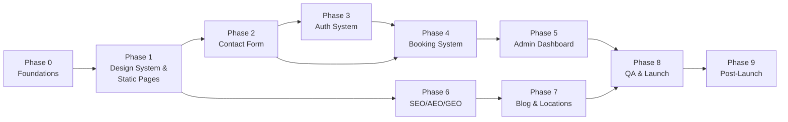

# H4Ai Website — Build Phases

**Purpose:** Ship the website in isolated, testable phases so each feature (design system → content → auth → booking → SEO → locations) is built, debugged, and stabilized before the next one starts. No phase should require touching a previous phase's core logic — if it does, that's a sign the boundary is wrong and should be revisited before continuing.

**Companion to:** `prd.md`, `Architecture.md`, `design.md`, `seo_aeo_geo.md`

Each phase below lists: **Goal · Scope · Tasks · Exit Criteria (what "done" means before moving on) · Depends On.**

---

## Phase 0 — Foundations & Environment

**Goal:** A clean, reproducible project skeleton with nothing feature-specific yet.

**Scope:**
- Repo init, Next.js (App Router) + TypeScript + Tailwind CSS + shadcn/ui + Framer Motion installed and configured.
- Vercel project connected, preview deploys working on PRs.
- Managed Postgres provisioned (Neon/Supabase), Prisma initialized with an empty schema.
- Resend account + sending domain (h4ai.in) DNS records (SPF/DKIM/DMARC) requested — this takes time to propagate, start early.
- Environment variable structure defined for `local` / `preview` / `production` (DB URL, session secret, Resend API key, cron secret).
- Linting, formatting (ESLint + Prettier), and a basic CI check (typecheck + lint) on PRs.
- Error monitoring (Sentry) and analytics (GA4/Plausible) stubs wired but not yet sending real events.

**Exit Criteria:** Empty Next.js app deploys successfully to a Vercel preview URL; Prisma can connect to the database; a placeholder email sends successfully through Resend in a test script.

**Depends on:** Nothing.

---

## Phase 1 — Design System & Static Marketing Pages

**Goal:** The site looks and feels finished (per `design.md`) even though nothing is dynamic yet.

**Scope:**
- Implement design tokens (colors, type scale, spacing) from `design.md` §2–3 into Tailwind config.
- Build core shadcn/ui theme overrides (buttons, cards, inputs) matching the palette.
- Build the Home page section-by-section (Hero → Problem → What You Get → Proof → How It Works → Final CTA → Footer) with static/placeholder copy from `seo_aeo_geo.md` §3.1.
- Add Framer Motion parallax on the hero visual and fade-up-on-scroll on section content; verify `prefers-reduced-motion` is respected.
- Build the 5 service pages, `/services` overview, `/about`, and `/contact` as **static** pages (real copy, no working form yet — form UI only).
- Build the branded 404 (`not-found.tsx`) and generic error boundary (`error.tsx`).
- Responsive QA across mobile/tablet/desktop breakpoints.
- Basic meta tags (title/description) per page per `seo_aeo_geo.md` — schema markup comes in Phase 6, not here.

**Exit Criteria:** Every static page in `prd.md` §6 (except locations/blog/booking/admin) is live, responsive, matches `design.md`, passes a Lighthouse pass for Performance/Accessibility ≥ 90 on the Home page.

**Depends on:** Phase 0.

---

## Phase 2 — Contact Form (Lead Capture)

**Goal:** The site can capture and notify on a real lead end-to-end — the simplest possible "full slice" through the stack (DB write + email send), used to prove the pattern before building the more complex booking system.

**Scope:**
- `LEAD` table (Prisma migration) per `Architecture.md` §3.
- `POST /api/leads` route handler: Zod validation, honeypot field, rate limiting.
- Wire the `/contact` form UI (built in Phase 1) to the real endpoint.
- Email Service module (`lib/email/`) built here for the first time — Resend client, base template layout (H4Ai-branded), and the first two templates: lead confirmation (visitor) + lead notification (admin).
- Admin email inbox configured to receive lead notifications (no admin dashboard UI yet — email is the only admin-facing surface at this phase).

**Exit Criteria:** Submitting the contact form creates a `LEAD` row, sends a confirmation email to the visitor, and a notification email to the admin inbox, in under a few seconds, with proper error handling if email dispatch fails (logged, not silently swallowed).

**Depends on:** Phase 0 (DB, Resend), Phase 1 (form UI).

---

## Phase 3 — Authentication System

**Goal:** A working, secure admin login exists before any admin-only feature (booking management) is built on top of it.

**Scope:**
- `ADMIN_USER` and `AUTH_TOKEN` tables per `Architecture.md` §3–4.
- Password hashing (bcrypt/argon2), session cookie issuance (httpOnly, signed, secure).
- Routes: `/admin/login`, `/admin/verify/[token]`, `/admin/forgot-password`, `/admin/reset-password/[token]` + matching API routes.
- Email templates: verification email, password reset email, password-changed notice.
- `middleware.ts` guarding `/admin/(protected)/*` — redirects unauthenticated requests to `/admin/login`.
- Rate limiting on login and forgot-password endpoints; generic (non-enumerating) error/success messages.
- Seed script to create the first admin account (no public self-signup in v1, per `prd.md` §8).
- Empty `/admin` dashboard shell (just a "Logged in as…" + logout button) — real dashboard content comes in Phase 5.

**Exit Criteria:** Full login → verify → login → forgot password → reset → login cycle works manually end to end; an unauthenticated request to any `/admin/(protected)/*` route is redirected; sessions are invalidated after a password reset.

**Depends on:** Phase 0 (DB, email module from Phase 2 reused here).

---

## Phase 4 — Meeting Booking System

**Goal:** The site's single primary conversion action ("Book a Call") is fully functional, including reminders and cancellation — this is the highest-risk phase, isolated deliberately so booking-logic bugs never block the simpler phases already shipped.

**Scope:**
- `AVAILABILITY_SLOT`, `SERVICE`, `BOOKING`, `BOOKING_TOKEN`, `EMAIL_LOG` tables per `Architecture.md` §3.
- Admin-side availability configuration UI (recurring working hours + blackout dates) inside `/admin/(protected)/availability` — first real dashboard feature, built on Phase 3's auth.
- Public booking UI: slot picker (shadcn/ui `Calendar`), booking form (name/email/phone/note), confirmation screen. Timezone conversion (visitor-local display, UTC storage).
- `POST /api/bookings` with transactional slot-locking to prevent double-booking (per the sequence diagram in `Architecture.md` §5).
- Email templates: booking confirmation (with `.ics` attachment + cancel link), admin lead notification.
- `GET/POST /api/bookings/cancel/[token]`: token validation, expired/used-token friendly state (not a generic 404 — per `prd.md` §5.7), cancellation confirmation emails to both parties.
- Cron jobs: `POST /api/cron/reminders` (24h and 1h before), `POST /api/cron/token-cleanup` (purges expired tokens) — scheduled via Vercel Cron.
- Admin bookings view (`/admin/(protected)/bookings`) — list, filter by status, manual cancel.
- Update Home/Service/Final-CTA "Book a Call" buttons (built as static in Phase 1) to link to the real booking flow.

**Exit Criteria:** A visitor can book a real slot end to end (confirmation + admin notification received); the slot becomes unavailable to others; reminder emails fire at the correct offsets in a staging test; cancellation via the emailed link works and releases the slot; admin can see and manually cancel bookings.

**Depends on:** Phase 2 (Email Service module), Phase 3 (auth, for the admin-facing availability/bookings views).

---

## Phase 5 — Admin Dashboard Consolidation

**Goal:** Bring leads + bookings + availability into one coherent, usable dashboard now that all three data sources exist.

**Scope:**
- Unified `/admin/(protected)/leads` view (from Phase 2 data) alongside the existing bookings/availability views.
- Basic status workflow on leads (NEW → CONTACTED → CLOSED).
- Dashboard home (`/admin`) summary: upcoming bookings this week, new leads count.
- Polish: loading states, empty states, pagination on lists.

**Exit Criteria:** Harsimran can run day-to-day operations (see who booked, who inquired, adjust availability) entirely from `/admin` without touching the database directly.

**Depends on:** Phase 2, Phase 3, Phase 4.

---

## Phase 6 — SEO / AEO / GEO Implementation

**Goal:** Turn the already-live static pages into fully optimized pages per `seo_aeo_geo.md` — deliberately sequenced *after* the pages are stable in Phase 1, so SEO work isn't repeatedly redone as copy/layout changes.

**Scope:**
- Structured data (`Organization`, `WebSite`, `Service`, `FAQPage`, `AboutPage`, `Person`, `ContactPage`) added to every relevant page per the spec in `seo_aeo_geo.md` §3.
- Direct-answer opener paragraphs finalized on every service/about page (GEO citability, §6 of that doc).
- FAQ blocks added and matched exactly to `FAQPage` schema content.
- `sitemap.xml`, `robots.txt`, canonical tags site-wide; submitted to Google Search Console.
- Image `alt` text audit against the documented patterns.
- Core Web Vitals pass: LCP/CLS/INP measured and optimized (image optimization, font loading strategy, JS bundle review) — target thresholds in `prd.md` §7.
- NAP block on `/contact` and footer locked to match the GBP listing exactly (coordinate with the separate GBP rollout in `h4ai-gbp-optimization.md`).
- `noindex` confirmed on all transactional/auth/booking-token routes.

**Exit Criteria:** Rich Results Test passes with no errors on all schema-bearing pages; Lighthouse SEO score ≥ 95 site-wide; sitemap submitted and indexed status confirmed in Search Console.

**Depends on:** Phase 1 (stable page content/layout).

---

## Phase 7 — Content Infrastructure: Blog & Location Pages

**Goal:** Stand up the data-driven content system for the long-tail AEO/GEO engine, then begin the deliberately slow rollout — this phase is explicitly capped in pace, not scope, per the hard rule in `seo_aeo_geo.md`.

**Scope:**
- Choose and wire the content source (MDX in-repo or headless CMS) per `Architecture.md` §"Content Service."
- Build `/blog` index + `/blog/[slug]` template, `/locations/[city]` dynamic route + template per `seo_aeo_geo.md` §3.8.
- Publish the **Mansa** location page first (full `LocalBusiness` schema, real content) — the anchor page.
- Publish **Chandigarh** and **Saskatoon** as the next two worked examples (per priority order in `seo_aeo_geo.md` §2).
- Publish the first 2–3 blog posts from the suggested list (§3.11 of that doc).
- **Rollout cadence going forward: 2–3 new location pages per month, each with a genuinely unique paragraph — never bulk-published.** This is a process constraint on the team, not a one-time build task, and should be tracked outside this phase (e.g., a content calendar) once the infrastructure ships.

**Exit Criteria:** Blog and location-page infrastructure is live and reusable; Mansa/Chandigarh/Saskatoon pages are published and pass the Phase 6 schema/SEO checks; the ongoing publishing cadence is documented and owned.

**Depends on:** Phase 6 (schema patterns), Phase 1 (design system).

---

## Phase 8 — QA, Security Hardening & Launch

**Goal:** Full regression pass across every feature phase before public launch.

**Scope:**
- Cross-browser/device QA of all flows: booking (create/reminder/cancel), auth (signup-verify/login/reset), contact form, 404/error states.
- Security pass: CSRF checks on all mutating routes, rate-limit verification, dependency audit, header hardening (CSP, HSTS via Vercel/Next config).
- Load-test the booking slot-locking logic specifically (concurrent booking attempts on the same slot) — this is the highest-risk correctness bug in the system.
- Legal pages published (`/privacy-policy`, `/terms`), linked from every form per `prd.md` §7.
- Accessibility audit (WCAG 2.1 AA) across all templates.
- Final Core Web Vitals check on production (not staging) data.
- DNS cutover to h4ai.in production, SSL verified, email deliverability re-tested from the production domain.

**Exit Criteria:** No P0/P1 bugs open; security checklist signed off; site live on h4ai.in.

**Depends on:** All prior phases.

---

## Phase 9 — Post-Launch Monitoring & Iteration (ongoing)

**Goal:** Keep the system healthy and keep the content engine moving after launch — this phase never "completes."

**Scope:**
- Monitor Sentry for runtime errors, Resend dashboard for email delivery failures.
- Weekly: review GA4/Plausible for conversion funnel drop-off (Home → Service → Book a Call → Confirmed).
- Monthly: continue location-page and blog rollout per the Phase 7 cadence; review Search Console for indexing/ranking movement and reallocate content effort per `h4ai-gbp-optimization.md` §"Month 2–3" guidance.
- Quarterly: revisit deferred v1 scope items (`prd.md` §8) — rescheduling UI, multi-admin roles, dark mode — and open a new mini-phase for any that become priorities.

**Exit Criteria:** N/A (continuous). Each iteration should still follow the same "isolated phase, clear exit criteria" discipline used above.

---

## Phase Sequencing Summary

**Why this order:** static pages ship first so there's something to show and to run Lighthouse/SEO against; the contact form ships next as the simplest possible full-stack slice (proves DB + email work) before the much riskier booking system; auth ships before booking because booking's admin views depend on it; SEO implementation is deliberately deferred until pages are visually stable (Phase 1) so schema/copy isn't rewritten twice; content infrastructure (blog/locations) comes after the SEO patterns exist so every new page is correct from day one instead of retrofitted.
